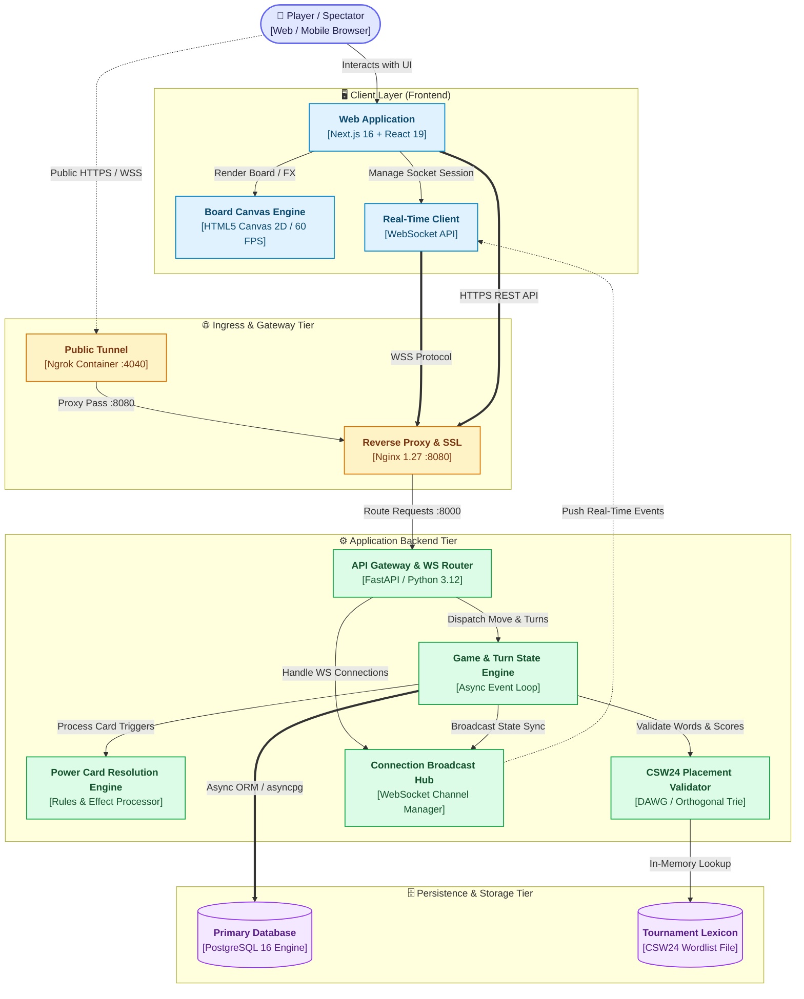
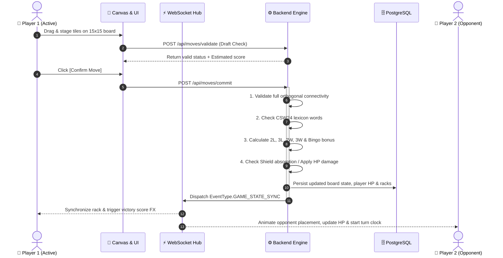

<div align="center">

# ⚔️ CROSSWORD BATTLE ARENA
### Real-Time Multiplayer Word Combat & Power Card Strategy

[](https://nextjs.org/)
[](https://react.dev/)
[](https://fastapi.tiangolo.com/)
[](https://python.org/)
[](https://www.postgresql.org/)
[](https://tailwindcss.com/)
[](https://www.docker.com/)
[](LICENSE)

<br/>

**A next-generation real-time multiplayer Crossword game blending competitive Scrabble strategy with RPG health combat, tactical Power Cards, and a high-performance 60 FPS Canvas rendering engine.**

<br/>

<table>
  <tr>
    <td align="center" width="25%">
      <a href="#-system-overview">
        <b>🌟 Overview</b><br/>
        <sub>Core Engine & Highlights</sub>
      </a>
    </td>
    <td align="center" width="25%">
      <a href="#-game-modes">
        <b>🎮 Game Modes</b><br/>
        <sub>HP Deathmatch vs Turn Score</sub>
      </a>
    </td>
    <td align="center" width="25%">
      <a href="#-power-card-arsenal">
        <b>⚡ Power Cards</b><br/>
        <sub>7 Tactical Cards & Effects</sub>
      </a>
    </td>
    <td align="center" width="25%">
      <a href="#-system-architecture">
        <b>🏗️ Architecture</b><br/>
        <sub>Tier Diagram & Move Sequence</sub>
      </a>
    </td>
  </tr>
  <tr>
    <td align="center" width="25%">
      <a href="#-project-structure">
        <b>📂 Project Structure</b><br/>
        <sub>Full Directory Tree</sub>
      </a>
    </td>
    <td align="center" width="25%">
      <a href="#-quick-start--installation">
        <b>🚀 Quick Start</b><br/>
        <sub>Docker & Local Setup</sub>
      </a>
    </td>
    <td align="center" width="25%">
      <a href="#-api--websocket-specification">
        <b>📡 API & WebSockets</b><br/>
        <sub>REST Endpoints & Events</sub>
      </a>
    </td>
    <td align="center" width="25%">
      <a href="#-testing">
        <b>🧪 Testing</b><br/>
        <sub>Automated Pytest Suites</sub>
      </a>
    </td>
  </tr>
</table>

</div>

<br/>

## 🌟 System Overview

Crossword Battle Arena transforms traditional word puzzle mechanics into an intense, competitive battle. Players place letters on a classic $15 \times 15$ grid governed by the official **CSW24 Lexicon**, where every scored point directly deals damage to opponents or builds towards tournament victory.

<br/>

<table>
  <tr>
    <td width="50%" valign="top">
      <h3>⚔️ Dynamic Combat & Health Engine</h3>
      <p>Transform standard word scores into lethal combat power. Manage your HP pool, activate defensive barrier shields, and time your heals to survive fierce opponent onslaughts.</p>
    </td>
    <td width="50%" valign="top">
      <h3>🎨 60 FPS HTML5 Canvas Engine</h3>
      <p>Custom multi-layer 2D canvas pipeline featuring sub-zero frost mists, crystalline tile fracture shaders, responsive panning, pinch-to-zoom camera physics, and tactical targeting reticles.</p>
    </td>
  </tr>
  <tr>
    <td width="50%" valign="top">
      <h3>⚡ Sub-50ms WebSocket Sync</h3>
      <p>High-throughput real-time state synchronization ensuring instant turn transitions, synchronized clocks, live tile drafting, and spectator broadcast streams.</p>
    </td>
    <td width="50%" valign="top">
      <h3>📖 Tournament CSW24 Lexicon</h3>
      <p>High-speed in-memory DAWG/Trie structure for instant validation of orthogonal words, letter multipliers (<code>2L</code>, <code>3L</code>, <code>2W</code>, <code>3W</code>), and 50-point Bingo rack dumps.</p>
    </td>
  </tr>
</table>

---

## 🎮 Game Modes

Choose between high-stakes elimination battles or classic competitive scoring formats:

| Mode | Win Condition | Core Mechanics & Scoring Flow |
| :--- | :--- | :--- |
| **⚔️ HP Deathmatch** | Last Player Standing | Players start with **100 HP**. Valid word scores deal direct HP damage to opponents. Players can mitigate damage with `SHIELD` or regenerate life with `HEAL`. When HP reaches 0, the player is eliminated. |
| **🏆 Turn Score Mode** | Highest Total Score | Traditional tournament rules across fixed rounds ($10, 15, 20$ turns). Players compete for maximum cumulative points through strategic multiplier usage and Bingo placements. |

---

## ⚡ Power Card Arsenal

Players collect and unleash game-changing tactical cards to disrupt opponent boards, steal tiles, or protect their own health:

| Card | Theme Color | Type | Tactical Effect |
| :--- | :--- | :--- | :--- |
| 💖 **Heal** | `Rose / Pink` | Instant Self | Restores player HP based on current rack tile values (with safety confirm dialog). |
| 🛡️ **Shield** | `Cyan / Blue` | Proactive Aura | Grants a radiant energy barrier around the HP bar that completely negates the next incoming attack. |
| ❄️ **Freeze Word** | `Sky / Frost` | Board Targeted | Locks an opponent's placed tile under sub-zero ice mist for 1 round, preventing plays through that cell. |
| 💥 **Clear Word** | `Orange / Red` | Board Targeted | Permanently vaporizes a target tile from the board, opening up new paths or breaking word connections. |
| 👁️ **Spell Word** | `Amber / Gold` | AI Assistant | Analyzes the current rack and board state to suggest the highest-scoring valid word placement. |
| 🔄 **Swap Word** | `Emerald / Teal` | Targeted PvP | Forces an exchange of up to 3 tiles with a targeted opponent's hidden rack. |
| ⚡ **Word ×2** | `Purple / Neo` | Next Move | Applies a $2\times$ multiplier to the damage or points generated on your next played word. |

---

## 🏗️ System Architecture

The application is structured into clean, modular tiers ensuring predictable state flow, high concurrency, and minimal latency:



<br/>

### 🔄 Real-Time Turn & Move Execution Lifecycle



---

## 📂 Project Structure

```
crossword-game/
├── backend/                        # FastAPI Python 3.12 Backend
│   ├── app/
│   │   ├── api/                    # REST API Endpoints
│   │   │   ├── cards.py            # Power card activation & targeting logic
│   │   │   ├── games.py            # Match creation, state query & lifecycle
│   │   │   ├── moves.py            # Word placement, validation & turn commit
│   │   │   └── rooms.py            # Lobby management & player seat assignment
│   │   ├── database/               # Async SQLAlchemy models & connection pool
│   │   ├── game/                   # Pure Scrabble logic & word algorithms
│   │   │   ├── dictionary.py       # CSW24 fast lookup & DAWG dictionary
│   │   │   ├── extractor.py        # 2D Orthogonal word extraction
│   │   │   ├── rules.py            # Placement legality & connectivity rules
│   │   │   └── scoring.py          # Word score multipliers & Bingo calculation
│   │   ├── services/               # Core business services (turn, room, card)
│   │   └── websocket/              # Real-time connection manager & handlers
│   ├── data/
│   │   └── CSW24.txt               # Collins Scrabble Words (CSW24) dictionary
│   └── tests/                      # Pytest automated test scenarios
│
├── frontend/                       # Next.js 16 + React 19 Frontend
│   ├── app/
│   │   ├── game/[gameId]/          # Real-time game battlefield & HUD
│   │   ├── lobby/[pin]/            # Room matchmaking & seat lobby
│   │   └── page.tsx                # Landing page & room creation
│   ├── components/
│   │   ├── board/                  # HTML5 Canvas 2D Game Board Engine
│   │   │   ├── BoardCanvas.tsx     # Pointer hit-testing & viewport camera
│   │   │   └── engine/             # Multi-layer canvas shaders & FX
│   │   ├── game/                   # PowerCardBar, RightSidebar, TurnTimer, HUD
│   │   └── rack/                   # TileRack, Drag-Drop floating tile ghost
│   ├── hooks/                      # Custom hooks (useGameSync, useBoardCamera)
│   └── lib/                        # API client, TypeScript definitions & theme
│
├── gateway/                        # Nginx reverse proxy configuration
├── docker-compose.yml              # Complete 5-container service orchestration
└── README.md
```

---

## 🚀 Quick Start & Installation

### Option 1: 🐳 One-Click Docker Setup (Recommended)

1. **Clone the repository**:
   ```bash
   git clone https://github.com/Cell1991/crossword-game.git
   cd crossword-game
   ```

2. **Configure environment variables**:
   ```bash
   cp .env.example .env
   ```

3. **Launch all services**:
   ```bash
   docker compose up --build
   ```

4. **Access the application**:
   - 🌐 **Web Client**: [http://localhost:3000](http://localhost:3000) *(or via Gateway at [http://localhost:8090](http://localhost:8090))*
   - 🔌 **API Documentation (Swagger)**: [http://localhost:8000/docs](http://localhost:8000/docs)
   - 🚇 **Ngrok Web Console**: [http://localhost:4040](http://localhost:4040)

---

### Option 2: 🛠️ Manual Local Development

<details>
<summary><b>Click to expand manual setup instructions</b></summary>

#### 1. Backend Setup
```bash
cd backend
python -m venv venv
# Windows:
.\venv\Scripts\activate
# Linux/macOS:
source venv/bin/activate

pip install -r requirements.txt
uvicorn main:app --host 0.0.0.0 --port 8000 --reload
```

#### 2. Frontend Setup
```bash
cd frontend
npm install
npm run dev
```

</details>

---

## 📡 API & WebSocket Specification

### 🌐 Key REST API Endpoints

| Method | Endpoint | Description |
| :--- | :--- | :--- |
| `POST` | `/api/rooms` | Create a new multiplayer lobby with custom game mode (HP / Turn) |
| `POST` | `/api/rooms/join` | Join an existing room lobby using a 6-digit Room PIN |
| `POST` | `/api/rooms/{pin}/start` | Host triggers match start, generating initial board and player racks |
| `POST` | `/api/moves/validate` | Check candidate tile placements without committing turn |
| `POST` | `/api/moves/commit` | Commit a word move, apply card effects, and compute scores/damage |
| `POST` | `/api/moves/exchange` | Exchange selected tiles with the tile bag (consumes turn) |
| `POST` | `/api/moves/pass` | Pass current turn to the next player |
| `POST` | `/api/cards/{gameId}/use` | Execute targeted or instant power card effects |

---

## 🧪 Testing

Execute full automated backend test suites covering game scenarios, card interactions, and move validation:

```bash
cd backend
pytest tests/ -v
```

---

## 👥 Contributors & Team Members

<div align="center">

<table>
  <tr>
    <td align="center" width="20%">
      <a href="https://github.com/Cell1991">
        <br />
        <sub><b>Cell1991</b></sub>
      </a>
      <br />
      <sub>Chu</sub>
    </td>
    <td align="center" width="20%">
      <a href="https://github.com/friend47">
        <br />
        <sub><b>friend47</b></sub>
      </a>
      <br />
      <sub>Peerapatr</sub>
    </td>
    <td align="center" width="20%">
      <a href="https://github.com/waiwaix43">
        <br />
        <sub><b>waiwaix43</b></sub>
      </a>
      <br />
      <sub>Natthaset</sub>
    </td>
    <td align="center" width="20%">
      <a href="https://github.com/Rednoselittledog">
        <br />
        <sub><b>Rednoselittledog</b></sub>
      </a>
      <br />
      <sub>Kanin Noisiri</sub>
    </td>
    <td align="center" width="20%">
      <a href="https://github.com/ReFresh-bit">
        <br />
        <sub><b>ReFresh-bit</b></sub>
      </a>
      <br />
      <sub>Freshy</sub>
    </td>
  </tr>
</table>

</div>

---

## 📄 License

This project is licensed under the **MIT License** — see the [LICENSE](LICENSE) file for details.

<div align="center">
  <sub>Built with ❤️ by the development team for competitive word puzzle and strategy enthusiasts.</sub>
</div>

