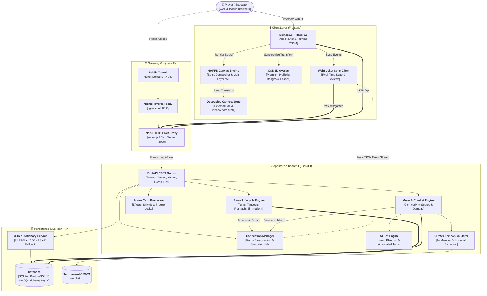
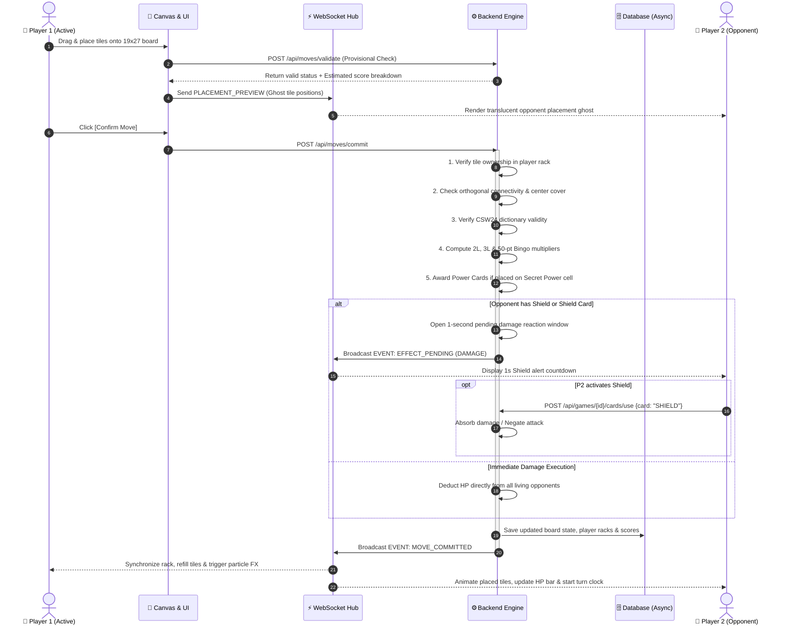

<div align="center">

# ⚔️ CROSSWORD BATTLE ARENA (WORDX)
### Real-Time Multiplayer Word Combat & Power Card Strategy

[](https://nextjs.org/)
[](https://react.dev/)
[](https://fastapi.tiangolo.com/)
[](https://python.org/)
[](https://www.postgresql.org/)
[](https://tailwindcss.com/)
[](https://www.docker.com/)
[](LICENSE)

<br/>

**A next-generation real-time multiplayer Crossword combat game blending competitive word building strategy with RPG health elimination, tactical Power Cards, adaptive AI bot opponents, and a 60 FPS Canvas rendering engine.**

<br/>

<table>
  <tr>
    <td align="center" width="25%">
      <a href="#-system-overview">
        <b>🌟 Overview</b><br/>
        <sub>Core Engine & Highlights</sub>
      </a>
    </td>
    <td align="center" width="25%">
      <a href="#-game-modes--ai-opponents">
        <b>🎮 Game Modes</b><br/>
        <sub>HP Combat, Turns & AI Bots</sub>
      </a>
    </td>
    <td align="center" width="25%">
      <a href="#-power-card-arsenal">
        <b>⚡ Power Cards</b><br/>
        <sub>Tactical Deck & Mechanics</sub>
      </a>
    </td>
    <td align="center" width="25%">
      <a href="#-board-mechanics--scoring">
        <b>📐 Board & Scoring</b><br/>
        <sub>19×27 Grid & Multipliers</sub>
      </a>
    </td>
  </tr>
  <tr>
    <td align="center" width="25%">
      <a href="#-system-architecture">
        <b>🏗️ Architecture</b><br/>
        <sub>Tier Diagram & Move Sequence</sub>
      </a>
    </td>
    <td align="center" width="25%">
      <a href="#-project-structure">
        <b>📂 Project Structure</b><br/>
        <sub>Full Directory Tree</sub>
      </a>
    </td>
    <td align="center" width="25%">
      <a href="#-quick-start--installation">
        <b>🚀 Quick Start</b><br/>
        <sub>Docker & Local Setup</sub>
      </a>
    </td>
    <td align="center" width="25%">
      <a href="#-api--websocket-specification">
        <b>📡 API & WebSockets</b><br/>
        <sub>REST Endpoints & Events</sub>
      </a>
    </td>
  </tr>
</table>

</div>

<br/>

---

## 🌟 System Overview

**Crossword Battle Arena** elevates classic crossword puzzle gameplay into a tactical, real-time battleground. Players place letters on an expansive **$19 \times 27$ grid** (starter coordinates centered at $(9, 13)$) validated against the official tournament **CSW24 Lexicon**. In battle mode, every point scored deals direct lethal damage to opponents, reinforced with power-ups, shields, and board-disrupting tactical cards.

<br/>

<table>
  <tr>
    <td width="50%" valign="top">
      <h3>⚔️ Real-Time Combat & Health Engine</h3>
      <p>Convert scored points into authoritative HP damage dealt to all living opponents. Survive by timing reactive <b>Shields</b> during the 1-second defense reaction window or recovering life with tile-based <b>Heals</b>.</p>
    </td>
    <td width="50%" valign="top">
      <h3>🎨 60 FPS HTML5 Canvas Rendering Engine</h3>
      <p>Custom multi-layer 2D canvas pipeline (<code>BoardCompositor</code>) featuring offscreen double-buffered grid caching, smooth physics-based panning and pinch/wheel zooming, and a decoupled CSS 3D hardware-accelerated multiplier overlay.</p>
    </td>
  </tr>
  <tr>
    <td width="50%" valign="top">
      <h3>⚡ Low-Latency WebSocket Synchronization</h3>
      <p>Bidirectional WebSocket stream (<code>/ws/games/{gameId}</code>) broadcasting sub-second turn transitions, live placement previews, active card resolution, timer countdowns, and real-time spectator feeds.</p>
    </td>
    <td width="50%" valign="top">
      <h3>📖 3-Tier Dictionary & Definition Engine</h3>
      <p>High-speed in-memory CSW24 lexicon validation paired with a 3-tier definition lookup: <b>L1 RAM Cache</b> &rarr; <b>L2 Database Persistence</b> &rarr; <b>L3 Asynchronous Online Fallback</b> with phonetics and parts of speech.</p>
    </td>
  </tr>
</table>

---

## 🎮 Game Modes & AI Opponents

Choose between high-stakes elimination battles, classic tournament scoring, or solo training with distinct AI bot personalities:

| Mode | Win Condition | Core Mechanics & Scoring Flow |
| :--- | :--- | :--- |
| **⚔️ HP Deathmatch (`HP`)** | Last Player Standing | Players start with configurable HP (**default 100 HP**, range 10–1000). Every valid word scored deals direct HP damage to all living opponents. When HP reaches 0, the player is eliminated. Mitigate damage via reactive `SHIELD` or regenerate life with `HEAL`. |
| **🏆 Turn Count Mode (`TURNS`)** | Highest Cumulative Score | Traditional tournament rules across fixed rounds (**default 7/14/21/28**, configurable up to 500 turns). Deals no HP damage. HP-specific cards are automatically excluded from the Secret Power pool to focus purely on strategic board placement. |
| **🤖 Solo Practice / AI Bot** | Practice & AI Challenge | Play solo to practice board layouts or challenge one of three distinct AI Bot personalities with automated turn scheduling. |
| **👁️ Spectator Mode** | Live Spectating | Spectators can watch live matches in real-time with placement previews and turn history without occupying player seats. |

### 🤖 AI Bot Personalities

| Bot Profile | Difficulty | AI Tactical Profile |
| :--- | :--- | :--- |
| ⚡ **SparkBot** | **Easy** | Novice AI. Prefers simple, short common words with relaxed board control. |
| 🔮 **Nexus AI** | **Medium** | Tactical AI. Evaluates mid-tier word lengths, strategic multiplier cells, and balanced card management. |
| 🛡️ **Titan AI** | **Hard** | Master AI. Aggressive high-scoring rack exploitation, seeking maximum multiplier yields and Bingo bonuses. |

---

## ⚡ 7 Power Card Arsenal

Players collect tactical Power Cards by placing letters onto **Lightning Power** cells on the board (maximum **3 cards** held at any time). Cards can be deployed to defend, disrupt opponents, or alter the board:

| Card | Backend ID | Target Type | Effect & Tactical Mechanics |
| :--- | :--- | :--- | :--- |
| 🛡️ **Shield** | `SHIELD` | Passive / Reaction | Blocks the next incoming attack damage or hostile tile swap completely. |
| 💖 **Heal** | `HEAL` | Instant Self | Restores HP equal to the sum of all tile point values currently in your rack. |
| ❄️ **Freeze Tile** | `FREEZE_TILE` | Board Cell | Locks a board tile in ice so opponents cannot connect words to it until your next turn. |
| 💥 **Destroy Tile** | `DESTROY_TILE` | Board Cell | Removes 1 tile from the board to break enemy words or reopen multiplier cells. |
| ⚔️ **Double Damage** | `DOUBLE_DAMAGE` | Targeted Rival | Your next confirmed word deals double ($2\times$) attack damage to a targeted opponent. |
| 🔄 **Spy Swap** | `SPY_SWAP` | Targeted Rival | Swap 1 to 3 rack tiles with random tiles stolen directly from an opponent. |
| 👁️ **Hint** | `HINT` | Your Turn | Highlights the top 3 highest-scoring word placements and point values. |

> [!NOTE]
> In **Turn Count Mode (`TURNS`)**, HP-specific cards (`HEAL`, `DOUBLE_DAMAGE`, `SHIELD`) are automatically omitted from the random card reward pool.

---

## 📐 Board Mechanics & Scoring

### 🗺️ The $19 \times 27$ Modular Grid

The game features an expanded **$19 \times 27$ grid** (19 rows $\times$ 27 columns) designed with an infinite-ready sparse coordinate architecture:
- **Center Cell**: Located at `(Row 9, Col 13)`. The first move of the match must cover this tile.
- **Sparse State Representation**: Saved in the database as coordinate keys `"{row}_{col}"`, allowing fast indexing and memory efficiency.
- **Mirror Coordinate Geometry**: Multipliers follow a periodic mirror pattern, ensuring symmetrical tactical hotspots across the board.

### 🌟 Premium Multiplier Squares

| Multiplier Square | Icon / Indicator | Multiplier Value | Board Functionality |
| :--- | :---: | :---: | :--- |
| **Triple Letter (3L)** | `3L` (Blue/Cyan) | $\times 3$ | Triples the point value of the newly placed letter on this cell. |
| **Double Letter (2L)** | `2L` (Light Blue) | $\times 2$ | Doubles the point value of the newly placed letter on this cell. |
| **Secret Power** | ★ (Violet / Purple) | Power Card Drop | Awards a random tactical Power Card to the player's hand when a tile is placed on it (if hand $< 3$). |
| **All-Tiles Bingo** | 🎯 `ALL_TILES_BONUS` | **+50 Points** | Extra bonus awarded when a player places all 7 rack tiles in a single turn. |

---

## 🏗️ System Architecture

The application is engineered into modular, loosely coupled tiers designed for high-concurrency real-time gameplay:



<br/>

### 🔄 Real-Time Turn & Move Execution Lifecycle



---

## 📂 Project Structure

```
crossword-game/
├── backend/                                # FastAPI Python 3.12 Backend
│   ├── app/
│   │   ├── api/                            # REST API Endpoints
│   │   │   ├── cards.py                    # Power Card activation & effect resolution
│   │   │   ├── debug.py                    # God-mode testing & state inspection
│   │   │   ├── dictionary.py               # Word definition & phonetics lookup
│   │   │   ├── games.py                    # Game lifecycle, pass, exchange, rematch & bot
│   │   │   ├── moves.py                    # Tile placement, validation & turn commit
│   │   │   └── rooms.py                    # Lobby management, PIN join & settings
│   │   ├── core/                           # Configuration, security & constants
│   │   ├── database/                       # SQLAlchemy Async models, state & connection pool
│   │   ├── game/                           # Core crossword game logic
│   │   │   ├── board.py                    # 19x27 Board definitions, multipliers & mirror logic
│   │   │   ├── dictionary.py               # CSW24 tournament wordlist loader & indexer
│   │   │   ├── extractor.py                # Orthogonal 2D word extraction
│   │   │   ├── game_end.py                 # Victory conditions & pass exhaustion
│   │   │   ├── hint.py                     # AI word candidate generator & hint solver
│   │   │   ├── offline_definitions.py      # Pre-seeded offline word definitions
│   │   │   ├── rules.py                    # Legal placement & connectivity verification
│   │   │   ├── scoring.py                  # Score calculation & 50-point Bingo bonus
│   │   │   └── tiles.py                    # Scrabble tile bag distribution & exchange logic
│   │   ├── schemas/                        # Pydantic request/response & WebSocket event models
│   │   ├── services/                       # Business logic services
│   │   │   ├── bot_service.py              # AI Bot planning & automated turn execution
│   │   │   ├── dictionary_lookup.py        # 3-tier L1/L2/L3 definition lookup service
│   │   │   ├── game_service.py             # Match turns, timeouts, rematch & state assembly
│   │   │   ├── move_service.py             # Authoritative move commitment & combat damage
│   │   │   └── room_service.py             # Room lifecycle, expiration & rematch lobbies
│   │   └── websocket/                      # Real-time WebSocket connection manager & handlers
│   ├── data/
│   │   └── wordlist.txt                    # Tournament lexicon database (CSW24)
│   ├── tests/                              # Automated Pytest test suites
│   ├── Dockerfile                          # Backend container definition
│   ├── main.py                             # FastAPI entrypoint, lifespan & CORS
│   └── requirements.txt                    # Python dependencies
│
├── frontend/                               # Next.js 16 + React 19 Client
│   ├── app/                                # Next.js App Router pages
│   │   ├── bot/page.tsx                    # Solo AI Bot match creation & difficulty setup
│   │   ├── game/[gameId]/page.tsx          # Real-time multiplayer game arena & HUD
│   │   ├── lobby/[pin]/page.tsx            # Room lobby, player readiness & rematch
│   │   ├── layout.tsx                      # Root layout & font configurations
│   │   └── page.tsx                        # Main landing hub, room browser & modal guides
│   ├── components/
│   │   ├── board/                          # HTML5 Canvas 2D Board Engine
│   │   │   ├── BoardCanvas.tsx             # Canvas host, viewport resizing & pointer events
│   │   │   ├── PremiumCellOverlay.tsx      # CSS 3D transformed multiplier badges & echoes
│   │   │   └── engine/
│   │   │       ├── BoardCompositor.ts      # Multi-layer rAF animation loop
│   │   │       ├── FXRenderer.ts           # Placement shockwaves, glow trails & floating text
│   │   │       ├── GridRenderer.ts         # Double-buffered offscreen cached grid background
│   │   │       └── TileRenderer.ts         # Beveled wood tiles, typography & freeze shaders
│   │   ├── game/                           # GameHUD, RightSidebar, TurnBanner, PowerCardBar
│   │   ├── lobby/                          # PlayerList, LobbyCard, RoomSettings
│   │   ├── rack/                           # TileRack, FloatingTile, DragPortal
│   │   └── ui/                             # CustomSelect, FullscreenButton, Modal
│   ├── hooks/                              # useBoardCamera, useTileDrag, useStagedMove, useGameSync
│   ├── lib/                                # API client, types, tile configurations & audio
│   ├── server.js                           # Custom Node server (Next.js + /api & /ws reverse proxy)
│   ├── package.json                        # Frontend dependencies & scripts
│   └── tailwind.config.ts                  # Tailwind CSS 4 styling configuration
│
├── gateway/                                # Nginx gateway configuration
│   └── nginx.conf                          # Reverse proxy routing for frontend & backend
├── docker-compose.yml                      # Full 5-service container stack orchestration
├── render.yaml                             # Cloud deployment configuration for Render
└── README.md                               # Project documentation
```

---

## 🚀 Quick Start & Installation

### Option 1: 🐳 Docker Compose (Full Stack Orchestration)

Launch the complete stack (Frontend, Backend, PostgreSQL, Nginx Gateway, Adminer, and Ngrok tunnel):

1. **Clone the repository**:
   ```bash
   git clone https://github.com/Cell1991/crossword-game.git
   cd crossword-game
   ```

2. **Prepare environment variables**:
   ```bash
   cp .env.example .env
   ```

3. **Start all containers**:
   ```bash
   docker compose up --build
   ```

4. **Access the application**:
   - 🌐 **Web Client**: [http://localhost:3000](http://localhost:3000) *(or via Gateway at [http://localhost:8090](http://localhost:8090))*
   - 🔌 **API Documentation (Swagger UI)**: [http://localhost:8000/docs](http://localhost:8000/docs)
   - 🗄️ **Database Adminer**: [http://localhost:8085](http://localhost:8085)
   - 🚇 **Ngrok Console (Tunneling)**: [http://localhost:4040](http://localhost:4040)

---

### Option 2: 🛠️ Local Development (Zero-Config SQLite)

You can run the backend and frontend locally without setting up an external database. The backend automatically initializes and uses a local **SQLite** database (`crossword.db`) by default.

#### 1. Backend Setup
```bash
cd backend

# Create and activate virtual environment
python -m venv venv
# On Windows (PowerShell):
.\venv\Scripts\Activate.ps1
# On Linux/macOS:
source venv/bin/activate

# Install dependencies
pip install -r requirements.txt

# Start backend development server
uvicorn main:app --host 0.0.0.0 --port 8000 --reload
```

#### 2. Frontend Setup
```bash
cd frontend

# Install npm dependencies
npm install

# Start development server (serves app and proxies /api & /ws to localhost:8000)
npm run dev
```

Open [http://localhost:3000](http://localhost:3000) in your browser.

---

## 📡 API & WebSocket Specification

### 🌐 Key REST API Endpoints

#### 🚪 Room & Lobby Management (`/api/rooms`)
| Method | Endpoint | Description |
| :--- | :--- | :--- |
| `GET` | `/api/rooms` | Retrieve a list of active public rooms waiting for players. |
| `POST` | `/api/rooms` | Create a new room with game mode (`HP` or `TURNS`), timer limits, and player capacity. |
| `GET` | `/api/rooms/{game_pin}` | Get room lobby details, joined players, and spectator counts. |
| `PATCH` | `/api/rooms/{game_pin}` | Update room settings (host only: max players, turn time limits). |
| `POST` | `/api/rooms/{game_pin}/join` | Join a room using its 6-digit Game PIN. |
| `POST` | `/api/rooms/{game_pin}/leave` | Leave a room lobby. |
| `POST` | `/api/rooms/{game_pin}/start` | Start the game match (host only). |

#### 🎮 Game & Move Actions (`/api/games` & `/api/moves`)
| Method | Endpoint | Description |
| :--- | :--- | :--- |
| `GET` | `/api/games/{game_id}` | Fetch current authoritative game state, player HP, scores, and board state. |
| `POST` | `/api/moves/validate` | Dry-run validation of provisional placed tiles without committing turn. |
| `POST` | `/api/moves/commit` | Commit a move, calculate multipliers, apply Bingo bonus, and deal damage. |
| `POST` | `/api/games/{game_id}/pass` | Pass turn to the next eligible player (4 consecutive passes end match). |
| `POST` | `/api/games/{game_id}/exchange` | Exchange rack tiles with the tile bag (requires $\ge 7$ bag tiles). |
| `POST` | `/api/games/{game_id}/timeout` | Advance turn when countdown timer expires. |
| `POST` | `/api/games/{game_id}/effects/resolve` | Finalize pending attack damage or tile swaps after the shield reaction window. |
| `POST` | `/api/games/{game_id}/rematch` | Create or join a synchronized rematch lobby following game completion. |
| `POST` | `/api/games/{game_id}/bot/plan` | Plan AI bot move based on rack, difficulty, and board state. |
| `POST` | `/api/games/{game_id}/bot/execute` | Commit a planned AI bot move, exchange, or pass. |

#### ⚡ Tactical Power Cards (`/api/games/{game_id}/cards`)
| Method | Endpoint | Description |
| :--- | :--- | :--- |
| `POST` | `/api/games/{game_id}/cards/use` | Deploy a held Power Card (`SHIELD`, `HEAL`, `FREEZE_TILE`, `DESTROY_TILE`, `DOUBLE_DAMAGE`, `SPY_SWAP`, `HINT`). |

#### 📖 Dictionary & Definitions (`/api/dictionary`)
| Method | Endpoint | Description |
| :--- | :--- | :--- |
| `GET` | `/api/dictionary/{word}` | Query word definitions, phonetic transcriptions, and meanings (L1 &rarr; L2 &rarr; L3). |

---

### ⚡ WebSocket Real-Time Events (`/ws/games/{game_id}`)

Clients establish a persistent real-time connection with heartbeat ping/pong support:
```text
ws://localhost:3000/ws/games/{game_id}?token={session_token}
```

#### Core Event Types
- `PLAYER_JOINED` / `PLAYER_LEFT`: Real-time lobby seat occupancy updates.
- `PLAYER_RECONNECTED` / `PLAYER_DISCONNECTED`: Connection state tracking (15-second grace period).
- `GAME_STARTED`: Signals match initialization and hands out starting tile racks.
- `PLACEMENT_PREVIEW`: Broadcasts translucent placement ghost tiles of active opponents.
- `MOVE_COMMITTED`: Synchronizes committed board tiles, formed words, and damage dealt.
- `TURN_PASSED` / `TILES_EXCHANGED`: Turn advance notification.
- `EFFECT_PENDING`: Alerts opponents to incoming attacks and starts the 1-second Shield window.
- `EFFECT_RESOLVED`: Confirms damage inflicted, blocked, or tile swaps completed.
- `CARD_USED`: Broadcasts tactical card activations to all players.
- `GAME_ENDED`: Match conclusion, final scoreboard, and victory declaration.
- `REMATCH_CREATED`: Invites all participants into a newly spawned rematch lobby.

---

## 🧪 Testing

The backend includes comprehensive automated test suites verifying Scrabble rule compliance, combat mechanics, card interactions, and room lifecycles:

```bash
cd backend

# Run the test suite with python module path configured
# On Windows PowerShell:
$env:PYTHONPATH="."
pytest tests/ -v

# On Linux/macOS:
PYTHONPATH=. pytest tests/ -v
```

---

## 👥 Contributors & Team Members

<div align="center">

<table>
  <tr>
    <td align="center" width="16.66%">
      <a href="https://github.com/Cell1991">
        <br />
        <sub><b>Cell1991</b></sub>
      </a>
      <br />
      <sub>Chu</sub>
    </td>
    <td align="center" width="16.66%">
      <a href="https://github.com/friend47">
        <br />
        <sub><b>friend47</b></sub>
      </a>
      <br />
      <sub>Peerapatr</sub>
    </td>
    <td align="center" width="16.66%">
      <a href="https://github.com/waiwaix43">
        <br />
        <sub><b>waiwaix43</b></sub>
      </a>
      <br />
      <sub>waiwaix43</sub>
    </td>
    <td align="center" width="16.66%">
      <a href="https://github.com/Natthaset2547">
        <br />
        <sub><b>Natthaset2547</b></sub>
      </a>
      <br />
      <sub>Natthaset</sub>
    </td>
    <td align="center" width="16.66%">
      <a href="https://github.com/Rednoselittledog">
        <br />
        <sub><b>Rednoselittledog</b></sub>
      </a>
      <br />
      <sub>Kanin Noisiri</sub>
    </td>
    <td align="center" width="16.66%">
      <a href="https://github.com/ReFresh-bit">
        <br />
        <sub><b>ReFresh-bit</b></sub>
      </a>
      <br />
      <sub>ReFresh-bit</sub>
    </td>
  </tr>
</table>

</div>

---

## 📄 License

This project is licensed under the **MIT License** — see the [LICENSE](LICENSE) file for details.

<div align="center">
  <sub>Built with ❤️ by the development team for competitive word puzzle and strategy enthusiasts.</sub>
</div>
