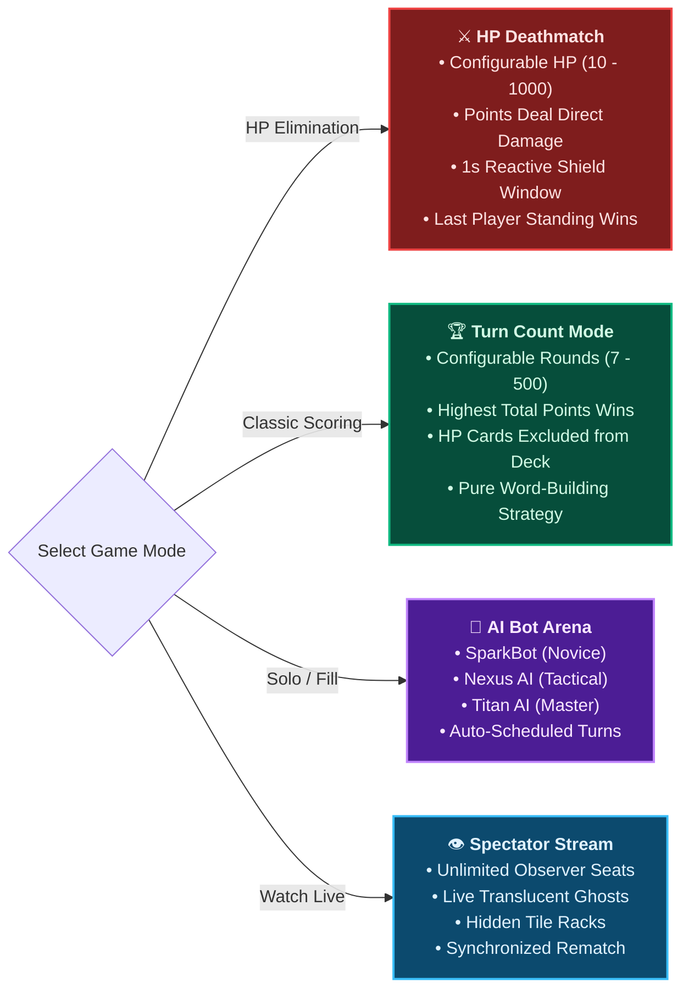
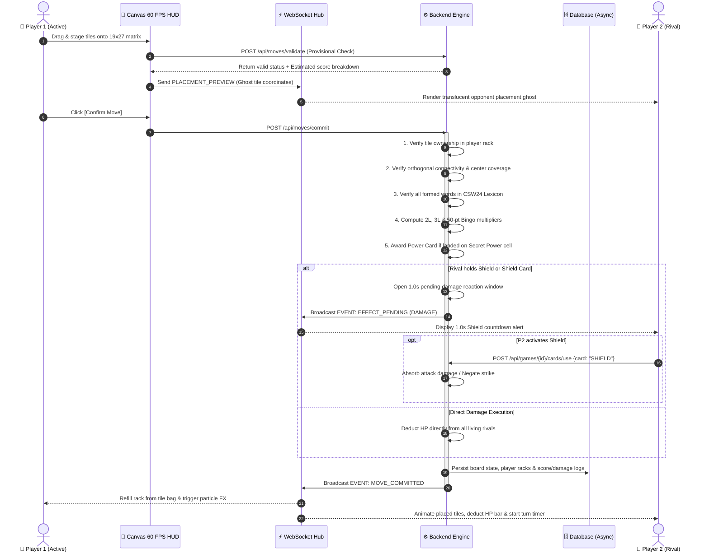
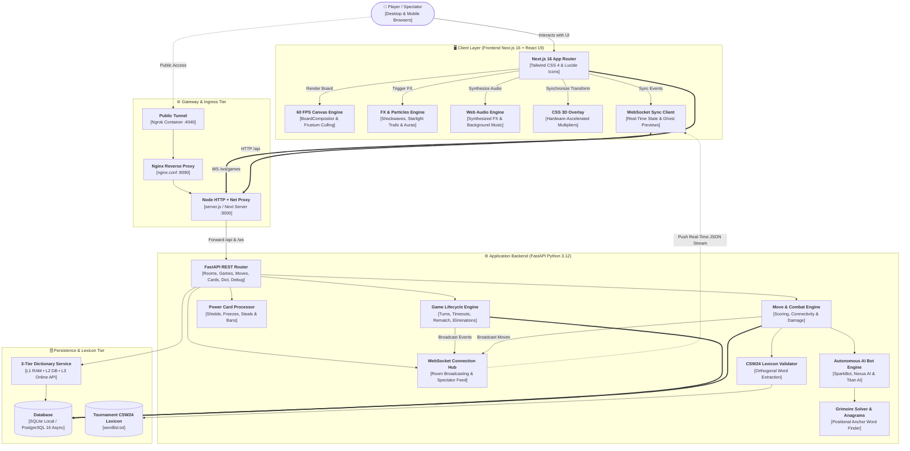
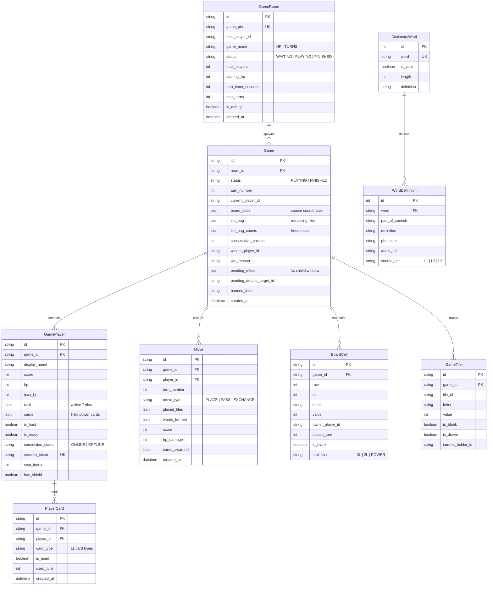

<div align="center">

<!-- ========================================================================= -->
<!-- ⚔️ HERO BANNER (Animated Cyberpunk SVG Header with Floating 3D Tiles)     -->
<!-- ========================================================================= -->
<a href="https://github.com/Cell1991/crossword-game">
  
</a>

<br/><br/>

<!-- ========================================================================= -->
<!-- 🛡️ SHIELD BADGES MATRIX (Technologies & Status)                           -->
<!-- ========================================================================= -->
[](https://nextjs.org/)
[](https://react.dev/)
[](https://fastapi.tiangolo.com/)
[](https://python.org/)
[](https://www.postgresql.org/)
[](https://www.sqlite.org/)
[](https://tailwindcss.com/)
[](https://developer.mozilla.org/en-US/docs/Web/API/Canvas_API)
[](https://developer.mozilla.org/en-US/docs/Web/API/WebSockets_API)
[](https://www.docker.com/)
[](LICENSE)

<br/>

**A next-generation real-time multiplayer Crossword combat battleground fusing competitive word-building mechanics with RPG health elimination, 11 tactical Power Cards, autonomous AI bot opponents, a 3-tier dictionary engine with Grimoire spellbook, and a 60 FPS HTML5 Canvas compositor.**

<br/>

<!-- ========================================================================= -->
<!-- 🧭 QUICK JUMP NAVIGATION BAR                                              -->
<!-- ========================================================================= -->
<table>
  <tr>
    <td align="center" width="20%">
      <a href="#-bento-grid-feature-matrix">
        <b>🍱 Bento Grid</b><br/>
        <sub>Feature Highlights</sub>
      </a>
    </td>
    <td align="center" width="20%">
      <a href="#-game-modes--ai-opponents">
        <b>🎮 Game Modes</b><br/>
        <sub>HP, Turns &amp; AI Bots</sub>
      </a>
    </td>
    <td align="center" width="20%">
      <a href="#-tactical-power-card-deck">
        <b>⚡ Power Cards</b><br/>
        <sub>11 Tactical Spells</sub>
      </a>
    </td>
    <td align="center" width="20%">
      <a href="#-1927-modular-matrix--scoring">
        <b>📐 Matrix &amp; Multipliers</b><br/>
        <sub>19×27 Grid Geometry</sub>
      </a>
    </td>
    <td align="center" width="20%">
      <a href="#-combat-lifecycle--sequence">
        <b>🔄 Combat Flow</b><br/>
        <sub>1.0s Shield Window</sub>
      </a>
    </td>
  </tr>
  <tr>
    <td align="center" width="20%">
      <a href="#-system-architecture">
        <b>🏗️ Architecture</b><br/>
        <sub>Full-Stack Dataflow</sub>
      </a>
    </td>
    <td align="center" width="20%">
      <a href="#-database-entity-relationship-model">
        <b>🗄️ Database ERD</b><br/>
        <sub>SQLAlchemy Schemas</sub>
      </a>
    </td>
    <td align="center" width="20%">
      <a href="#-project-directory-tree">
        <b>📂 Directory Tree</b><br/>
        <sub>File Organization</sub>
      </a>
    </td>
    <td align="center" width="20%">
      <a href="#-quick-start--installation">
        <b>🚀 Quick Start</b><br/>
        <sub>Docker &amp; SQLite Setup</sub>
      </a>
    </td>
    <td align="center" width="20%">
      <a href="#-api--websocket-specification">
        <b>📡 API &amp; WebSockets</b><br/>
        <sub>REST &amp; Live Events</sub>
      </a>
    </td>
  </tr>
</table>

</div>

<br/>

---

## 🍱 Bento Grid Feature Matrix

<br/>

<!-- Animated Bento Grid SVG Diagram -->
<div align="center">
  
</div>

<br/>

### 🌟 Deep Feature Breakdown

| Core Pillar | Technical Implementation | Gameplay & Strategic Impact |
| :--- | :--- | :--- |
| **🎨 60 FPS Canvas Engine** | Custom `BoardCompositor` with offscreen double-buffered bitmap grid caching, dynamic frustum culling, inertial camera pan/zoom, and starlight comet particle trails (`FXRenderer`). | Butter-smooth 60 FPS rendering on high-DPI desktop and mobile screens, eliminating DOM lag across the expansive $19 \times 27$ grid. |
| **⚔️ HP Combat Engine** | Scored word points are converted authoritatively into lethal damage dealt to living rivals. Features a 1.0-second reactive `SHIELD` reaction window, rack-based `HEAL`, and spectator demotion at 0 HP. | Replaces passive word games with high-intensity elimination combat where defensive timing and offensive burst damage decide victory. |
| **📖 3-Tier Dictionary &amp; Grimoire** | In-memory **CSW24 Tournament Lexicon** (`wordlist.txt`), multi-tier definition cache (**L1 RAM** &rarr; **L2 Database** &rarr; **L3 Async Online API**), and positional anagram spellbook (`grimoire.py`). | Sub-millisecond orthogonal validation with rich definitions, phonetic IPA transcriptions, and instant AI move generation. |
| **🤖 Autonomous AI Bot Triad** | 3 difficulty profiles (**SparkBot / Easy**, **Nexus AI / Medium**, **Titan AI / Hard**) driven by heuristic candidate solvers and auto-scheduled turn executors (`bot_service.py`). | Enables solo offline practice or automatically fills vacant lobby seats with believable, competitive tactical opponents. |
| **⚡ Low-Latency WebSocket Stream** | Persistent real-time stream (`/ws/games/{id}`) broadcasting turn clocks, translucent placement ghosts, card shockwaves, spectator feeds, and 15-second reconnection grace. | True sub-second multiplayer synchronization allowing rivals to watch opponents stage tiles live before committing. |
| **🎵 Dynamic Sound &amp; Themes** | Web Audio API synthesized sound FX, ambient background soundtracks (`BackgroundMusic`), and 4 switchable tile palettes (Wooden, Golden, Ivory, Neon Obsidian). | Immersive audio-visual tactile feedback on tile drops, power card triggers, Bingo bonuses, and elimination alerts. |

---

## 🎮 Game Modes & AI Opponents

<br/>

<!-- Animated Game Modes Showcase Graphic -->
<div align="center">
  
</div>

<br/>

### 🕹️ Match Modes Specification



---

## ⚡ Tactical Power Card Deck

Players acquire tactical Power Cards by placing letters onto **Secret Power (★)** cells on the board (maximum **3 cards** held in hand). Cards can be deployed strategically to defend, attack rivals, or manipulate the board state:

<br/>

<!-- Animated Power Cards Arsenal Graphic -->
<div align="center">
  
</div>

<br/>

### 🎴 Complete 11-Card Tactical Index

| Card Name | Backend Key | Target Type | Energy Cost | Tactical Mechanics & Strategic Application |
| :--- | :--- | :--- | :---: | :--- |
| 🛡️ **Shield** | `SHIELD` | Passive / Reaction | 0 | Automatically deflects the next incoming attack damage or hostile tile swap during the 1.0s defense reaction window. |
| 💖 **Heal** | `HEAL` | Instant Self | 0 | Instantly restores HP equal to the sum of all tile point values currently sitting in your rack. |
| ❄️ **Freeze Tile** | `FREEZE_TILE` | Board Cell | 0 | Locks a targeted board tile in ice crystal armor. Rivals cannot connect words to this tile until your next turn. |
| 💥 **Destroy Tile** | `DESTROY_TILE` | Board Cell | 0 | Demolishes 1 existing tile from the matrix, severing enemy word pathways or reopening premium multiplier cells. |
| ⚔️ **Double Damage** | `DOUBLE_DAMAGE` | Targeted Rival | 0 | Charges your next committed word with $2\times$ lethal attack damage directed at a chosen opponent. |
| 🔄 **Spy Swap** | `SPY_SWAP` | Targeted Rival | 0 | Stealthily swaps 1 to 3 designated tiles from your rack with random tiles stolen directly from a rival's rack. |
| 👁️ **Hint** | `HINT` | Your Turn | 0 | Computes and highlights the top 3 highest-scoring legal word placements and coordinate paths on the current board. |
| 🚫 **Ban Letter** | `BAN_LETTER` | Room Global | 0 | Declares a specific alphabet character banned across the match; opponents cannot place this letter on their turn. |
| 🔄 **Free Exchange** | `FREE_EXCHANGE` | Instant Self | 0 | Allows you to discard and redraw selected rack tiles from the bag without forfeiting or advancing your turn. |
| 🎴 **Draw Tile** | `DRAW_TILE` | Instant Self | 0 | Immediately draws 1 extra bonus tile from the bag into your active rack. |
| 💖 **Move Heal** | `MOVE_HEAL` | Self Passive | 0 | Passively heals your HP proportional to the score of your next committed word placement. |

> [!NOTE]
> In **Turn Count Mode (`TURNS`)**, all HP-specific combat cards (`HEAL`, `DOUBLE_DAMAGE`, `SHIELD`, `MOVE_HEAL`) are automatically excluded from the random card drop pool to preserve classic Scrabble balance.

---

## 📐 19×27 Modular Matrix & Multipliers

<br/>

<!-- Animated Board Radar & Multipliers Graphic -->
<div align="center">
  
</div>

<br/>

### 🗺️ The $19 \times 27$ Modular Matrix Geometry

```
                    COLUMNS: 0 ──────────────────────── 13 ──────────────────────── 26
 ROW  0  ┌─────────────────────────────────────────────────────────────────────────┐
         │  [3L]         [2L]                  [3L]                  [2L]         [3L] │
         │         [2L]        [★]                      [★]        [2L]            │
         │   [2L]        [3L]        [2L]        [2L]        [3L]        [2L]      │
         │                                                                         │
 ROW  9  │  [3L]   [★]   [2L]   [2L]       ★ CENTER (9,13)      [2L]   [2L]   [★]  [3L] │
         │                                                                         │
         │   [2L]        [3L]        [2L]        [2L]        [3L]        [2L]      │
         │         [2L]        [★]                      [★]        [2L]            │
 ROW 18  │  [3L]         [2L]                  [3L]                  [2L]         [3L] │
         └─────────────────────────────────────────────────────────────────────────┘
```

- **⭐ Center Star**: Coordinates `(Row 9, Col 13)`. The opening move of the match must cover this tile.
- **🔢 Multiplier Math**:
  - **Triple Letter (3L)**: Triples ($3\times$) the newly placed tile point value in all newly formed words.
  - **Double Letter (2L)**: Doubles ($2\times$) the newly placed tile point value in all newly formed words.
  - **Secret Power Square (★)**: Triggers an instant Power Card drop to the player's hand (capacity 3 cards).
  - **🎯 All-Tiles Bingo**: Placing all 7 rack tiles in a single turn triggers a lethal **+50 Points Bonus** and screen shockwave!

---

## 🔄 Combat Lifecycle & Sequence

<br/>

<!-- Animated Turn & Combat Flow Graphic -->
<div align="center">
  
</div>

<br/>



---

## 🏗️ System Architecture

<br/>

<!-- Animated System Architecture SVG -->
<div align="center">
  
</div>

<br/>



---

## 🗄️ Database Entity-Relationship Model



---

## 📂 Project Directory Tree

```
crossword-game/
├── backend/                                # FastAPI Python 3.12 Backend
│   ├── app/
│   │   ├── api/                            # REST API Endpoints
│   │   │   ├── cards.py                    # Power Card activation & effect resolution
│   │   │   ├── debug.py                    # God-mode testing & multi-player simulation
│   │   │   ├── dictionary.py               # Word definition & phonetics lookup
│   │   │   ├── games.py                    # Game lifecycle, pass, exchange, rematch & bot
│   │   │   ├── history.py                  # Move & card usage history queries
│   │   │   ├── moves.py                    # Tile placement, validation & turn commit
│   │   │   └── rooms.py                    # Lobby management, PIN join & settings
│   │   ├── core/                           # Configuration, security & constants
│   │   ├── database/                       # SQLAlchemy Async models, state & connection pool
│   │   ├── game/                           # Core crossword game logic
│   │   │   ├── board.py                    # 19x27 Board definitions, multipliers & mirror logic
│   │   │   ├── dictionary.py               # CSW24 tournament wordlist loader & indexer
│   │   │   ├── extractor.py                # Orthogonal 2D word extraction
│   │   │   ├── game_end.py                 # Victory conditions & pass exhaustion
│   │   │   ├── grimoire.py                 # Positional anagram word solver & cache
│   │   │   ├── hint.py                     # AI word candidate generator & hint solver
│   │   │   ├── offline_definitions.py      # Pre-seeded offline word definitions
│   │   │   ├── rules.py                    # Legal placement & connectivity verification
│   │   │   ├── scoring.py                  # Score calculation & 50-point Bingo bonus
│   │   │   └── tiles.py                    # Tile bag distribution & exchange logic
│   │   ├── schemas/                        # Pydantic request/response & WebSocket event models
│   │   ├── services/                       # Business logic services
│   │   │   ├── bot_service.py              # AI Bot planning & automated turn execution
│   │   │   ├── dictionary_lookup.py        # 3-tier L1/L2/L3 definition lookup service
│   │   │   ├── game_service.py             # Match turns, timeouts, rematch & state assembly
│   │   │   ├── move_service.py             # Authoritative move commitment & combat damage
│   │   │   └── room_service.py             # Room lifecycle, expiration & rematch lobbies
│   │   └── websocket/                      # Real-time WebSocket connection manager & handlers
│   ├── data/
│   │   └── wordlist.txt                    # Tournament lexicon database (CSW24)
│   ├── tests/                              # Automated Pytest test suites
│   ├── Dockerfile                          # Backend container definition
│   ├── main.py                             # FastAPI entrypoint, lifespan & CORS
│   └── requirements.txt                    # Python dependencies
│
├── frontend/                               # Next.js 16 + React 19 Client
│   ├── app/                                # Next.js App Router pages
│   │   ├── bot/page.tsx                    # Solo AI Bot match creation & difficulty setup
│   │   ├── game/[gameId]/page.tsx          # Real-time multiplayer game arena & HUD
│   │   ├── lobby/[pin]/page.tsx            # Room lobby, player readiness & rematch
│   │   ├── layout.tsx                      # Root layout & font configurations
│   │   └── page.tsx                        # Main landing hub, room browser & modal guides
│   ├── components/
│   │   ├── audio/                          # BackgroundMusic & synthesized sound effects
│   │   ├── board/                          # HTML5 Canvas 2D Board Engine
│   │   │   ├── BoardCanvas.tsx             # Canvas host, viewport resizing & pointer events
│   │   │   ├── PremiumCellOverlay.tsx      # CSS 3D transformed multiplier badges & echoes
│   │   │   └── engine/
│   │   │       ├── BoardCompositor.ts      # Multi-layer rAF animation loop & frustum culling
│   │   │       ├── FXRenderer.ts           # Placement shockwaves, glow trails & floating text
│   │   │       ├── GridRenderer.ts         # Double-buffered offscreen cached grid background
│   │   │       └── TileRenderer.ts         # Beveled wood tiles, typography & freeze shaders
│   │   ├── debug/                          # DebugPanel god-mode session switcher
│   │   ├── game/                           # GameHUD, RightSidebar, TurnBanner, PowerCardBar
│   │   ├── lobby/                          # PlayerList, LobbyCard, RoomSettings
│   │   ├── notification/                   # EnableNotify permission request component
│   │   ├── rack/                           # TileRack, FloatingTile, DragPortal
│   │   └── ui/                             # CustomSelect, FullscreenButton, Modal
│   ├── hooks/                              # useBoardCamera, useTileDrag, useStagedMove, useGameSync
│   ├── lib/                                # API client, types, tile configurations & audio
│   ├── server.js                           # Custom Node server (Next.js + /api & /ws reverse proxy)
│   ├── package.json                        # Frontend dependencies & scripts
│   └── tailwind.config.ts                  # Tailwind CSS 4 styling configuration
│
├── docs/                                   # Documentation & Animated Assets
│   ├── assets/                             # Animated SVGs (Hero, Bento, Modes, Cards, Radar, Flow, Arch)
│   └── TEST_SCENARIOS.md                   # Complete test scenarios and edge-case matrix
├── gateway/                                # Nginx gateway configuration
│   └── nginx.conf                          # Reverse proxy routing for frontend & backend
├── docker-compose.yml                      # Full 5-service container stack orchestration
├── render.yaml                             # Cloud deployment configuration for Render
└── README.md                               # Project documentation
```

---

## 🚀 Quick Start & Installation

### Option 1: 🐳 Docker Compose (Full Stack Orchestration)

Launch the complete container stack (Frontend, Backend, PostgreSQL, Nginx Gateway, Adminer, and Ngrok tunnel):

1. **Clone the repository**:
   ```bash
   git clone https://github.com/Cell1991/crossword-game.git
   cd crossword-game
   ```

2. **Prepare environment variables**:
   ```bash
   cp .env.example .env
   ```

3. **Start all containers**:
   ```bash
   docker compose up --build
   ```

4. **Access the application**:
   - 🌐 **Web Client**: [http://localhost:3000](http://localhost:3000) *(or via Gateway at [http://localhost:8090](http://localhost:8090))*
   - 🔌 **API Documentation (Swagger UI)**: [http://localhost:8000/docs](http://localhost:8000/docs)
   - 🗄️ **Database Adminer**: [http://localhost:8085](http://localhost:8085)
   - 🚇 **Ngrok Console (Tunneling)**: [http://localhost:4040](http://localhost:4040)

---

### Option 2: 🛠️ Local Development (Zero-Config SQLite)

You can run the backend and frontend locally without installing PostgreSQL. The backend automatically initializes and uses a local **SQLite** database (`crossword.db`) by default.

#### 1. Backend Setup
```bash
cd backend

# Create and activate virtual environment
python -m venv venv
# On Windows (PowerShell):
.\venv\Scripts\Activate.ps1
# On Linux/macOS:
source venv/bin/activate

# Install dependencies
pip install -r requirements.txt

# Start backend development server
uvicorn main:app --host 0.0.0.0 --port 8000 --reload
```

#### 2. Frontend Setup
```bash
cd frontend

# Install npm dependencies
npm install

# Start development server (serves app and proxies /api & /ws to localhost:8000)
npm run dev
```

Open [http://localhost:3000](http://localhost:3000) in your browser.

---

## 📡 API & WebSocket Specification

### 🌐 Key REST API Endpoints

#### 🚪 Room & Lobby Management (`/api/rooms`)
| Method | Endpoint | Description |
| :--- | :--- | :--- |
| `GET` | `/api/rooms` | Retrieve a list of active public rooms waiting for players. |
| `POST` | `/api/rooms` | Create a new room with game mode (`HP` or `TURNS`), timer limits, and player capacity. |
| `GET` | `/api/rooms/{game_pin}` | Get room lobby details, joined players, and spectator counts. |
| `PATCH` | `/api/rooms/{game_pin}` | Update room settings (host only: max players, turn time limits). |
| `POST` | `/api/rooms/{game_pin}/join` | Join a room using its 6-digit Game PIN. |
| `POST` | `/api/rooms/{game_pin}/leave` | Leave a room lobby. |
| `POST` | `/api/rooms/{game_pin}/start` | Start the game match (host only). |

#### 🎮 Game & Move Actions (`/api/games` & `/api/moves`)
| Method | Endpoint | Description |
| :--- | :--- | :--- |
| `GET` | `/api/games/{game_id}` | Fetch current authoritative game state, player HP, scores, and board state. |
| `POST` | `/api/moves/validate` | Dry-run validation of provisional placed tiles without committing turn. |
| `POST` | `/api/moves/commit` | Commit a move, calculate multipliers, apply Bingo bonus, and deal damage. |
| `POST` | `/api/games/{game_id}/pass` | Pass turn to the next eligible player (4 consecutive passes end match). |
| `POST` | `/api/games/{game_id}/exchange` | Exchange rack tiles with the tile bag (requires $\ge 7$ bag tiles). |
| `POST` | `/api/games/{game_id}/timeout` | Advance turn when countdown timer expires. |
| `POST` | `/api/games/{game_id}/effects/resolve` | Finalize pending attack damage or tile swaps after the shield reaction window. |
| `POST` | `/api/games/{game_id}/rematch` | Create or join a synchronized rematch lobby following game completion. |
| `POST` | `/api/games/{game_id}/bot/plan` | Plan AI bot move based on rack, difficulty, and board state. |
| `POST` | `/api/games/{game_id}/bot/execute` | Commit a planned AI bot move, exchange, or pass. |

#### ⚡ Tactical Power Cards (`/api/games/{game_id}/cards`)
| Method | Endpoint | Description |
| :--- | :--- | :--- |
| `POST` | `/api/games/{game_id}/cards/use` | Deploy a held Power Card (`SHIELD`, `HEAL`, `FREEZE_TILE`, `DESTROY_TILE`, `DOUBLE_DAMAGE`, `SPY_SWAP`, `HINT`, `BAN_LETTER`, `FREE_EXCHANGE`, `DRAW_TILE`). |

#### 📖 Dictionary & Definitions (`/api/dictionary`)
| Method | Endpoint | Description |
| :--- | :--- | :--- |
| `GET` | `/api/dictionary/{word}` | Query word definitions, phonetic transcriptions, and meanings (L1 &rarr; L2 &rarr; L3). |

---

### ⚡ WebSocket Real-Time Events (`/ws/games/{game_id}`)

Clients establish a persistent real-time connection with heartbeat ping/pong support:
```text
ws://localhost:3000/ws/games/{game_id}?token={session_token}
```

#### Core Event Types
- `PLAYER_JOINED` / `PLAYER_LEFT`: Real-time lobby seat occupancy updates.
- `PLAYER_RECONNECTED` / `PLAYER_DISCONNECTED`: Connection state tracking (15-second grace period).
- `GAME_STARTED`: Signals match initialization and hands out starting tile racks.
- `PLACEMENT_PREVIEW`: Broadcasts translucent placement ghost tiles of active opponents.
- `MOVE_COMMITTED`: Synchronizes committed board tiles, formed words, and damage dealt.
- `TURN_PASSED` / `TILES_EXCHANGED`: Turn advance notification.
- `EFFECT_PENDING`: Alerts opponents to incoming attacks and starts the 1.0-second Shield window.
- `EFFECT_RESOLVED`: Confirms damage inflicted, blocked, or tile swaps completed.
- `CARD_USED`: Broadcasts tactical card activations to all players.
- `GAME_ENDED`: Match conclusion, final scoreboard, and victory declaration.
- `REMATCH_CREATED`: Invites all participants into a newly spawned rematch lobby.

---

## 🧪 Testing & Verification

The backend includes comprehensive automated test suites verifying Scrabble rule compliance, combat mechanics, card interactions, and room lifecycles:

```bash
cd backend

# Run the test suite with python module path configured
# On Windows PowerShell:
$env:PYTHONPATH="."
pytest tests/ -v

# On Linux/macOS:
PYTHONPATH=. pytest tests/ -v
```

---

## 👥 Contributors & Development Team

<div align="center">

<table>
  <tr>
    <td align="center" width="16.66%">
      <a href="https://github.com/Cell1991">
        <br />
        <sub><b>Cell1991</b></sub>
      </a>
      <br />
      <sub>Chu</sub>
    </td>
    <td align="center" width="16.66%">
      <a href="https://github.com/friend47">
        <br />
        <sub><b>friend47</b></sub>
      </a>
      <br />
      <sub>Peerapatr</sub>
    </td>
    <td align="center" width="16.66%">
      <a href="https://github.com/waiwaix43">
        <br />
        <sub><b>waiwaix43</b></sub>
      </a>
      <br />
      <sub>waiwaix43</sub>
    </td>
    <td align="center" width="16.66%">
      <a href="https://github.com/Natthaset2547">
        <br />
        <sub><b>Natthaset2547</b></sub>
      </a>
      <br />
      <sub>Natthaset</sub>
    </td>
    <td align="center" width="16.66%">
      <a href="https://github.com/Rednoselittledog">
        <br />
        <sub><b>Rednoselittledog</b></sub>
      </a>
      <br />
      <sub>Kanin Noisiri</sub>
    </td>
    <td align="center" width="16.66%">
      <a href="https://github.com/ReFresh-bit">
        <br />
        <sub><b>ReFresh-bit</b></sub>
      </a>
      <br />
      <sub>ReFresh-bit</sub>
    </td>
  </tr>
</table>

</div>

---

## 📄 License

This project is open source and available under the **[MIT License](LICENSE)**.

<div align="center">
  <sub>Crafted with passion for competitive word puzzle combat and real-time tactical multiplayer gaming.</sub>
</div>
